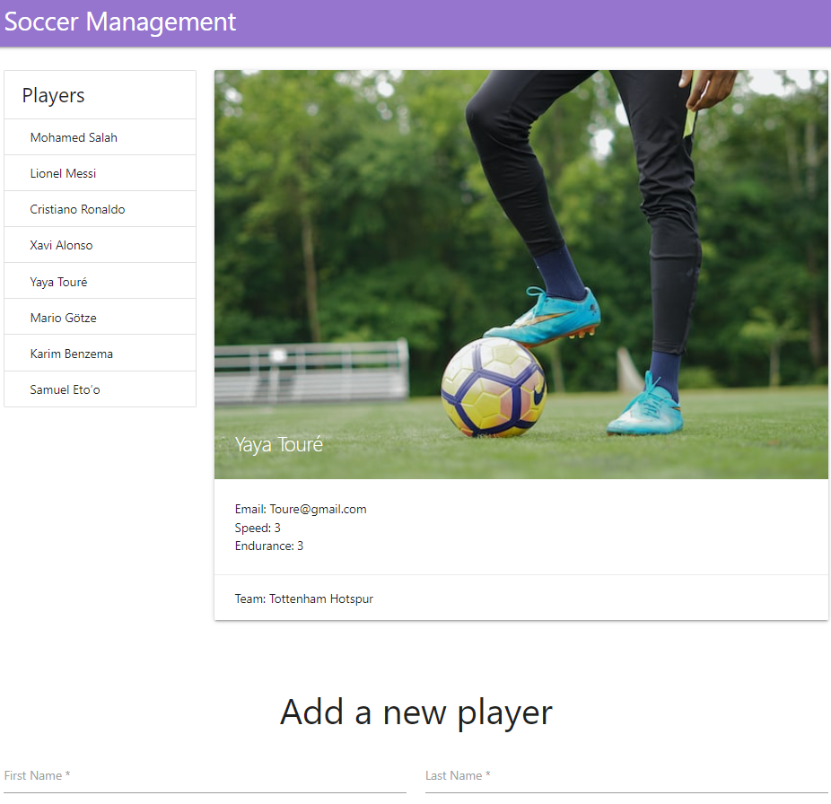

# Soccer Management

My first MERN app

- In the backend I used Node.js, Express, MongoDB, and Mongoose to create players API that has a CRUD operations
- And I used React on the frontend, where we can view, and add players

#### Project Setup

On both frontend and backend folders, run

```
npm install
```

then

```
npm start
```

#### Screenshot


